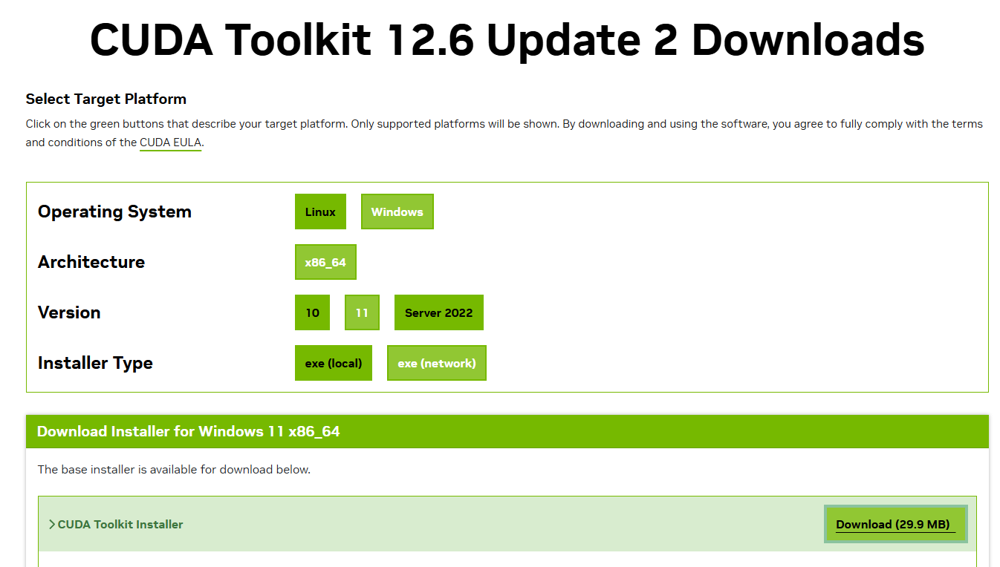
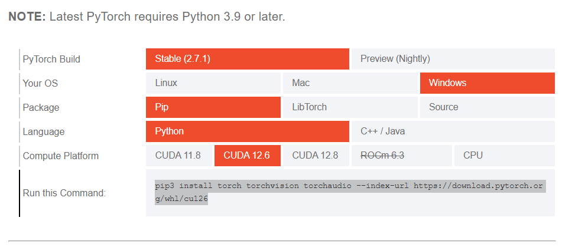
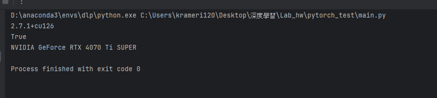

# 安裝方法

## 安裝cuda tool kit
先查詢cuda version
```commandline
nvidia-smi
```
網頁查找對應的版本
https://docs.nvidia.com/cuda/cuda-toolkit-release-notes/index.html




## anaconda prompt 建置環境
```commandline
conda create -n dlp python=3.10
conda activate dlp
```

## pytorch 安裝
https://pytorch.org/get-started/locally/?__hstc=76629258.724dacd2270c1ae797f3a62ecd655d50.1746547368336.1746547368336.1746547368336.1&__hssc=76629258.9.1746547368336&__hsfp=2230748894

```commandline
pip3 install torch torchvision torchaudio --index-url https://download.pytorch.org/whl/cu126
```

## 完成測試
```commandline
import torch
print(torch.__version__)         # 應該顯示你剛裝的版本
print(torch.cuda.is_available()) # True 表示能用 GPU
print(torch.cuda.get_device_name(0))  # 顯示 GPU 名稱（如 RTX 4060）

```
